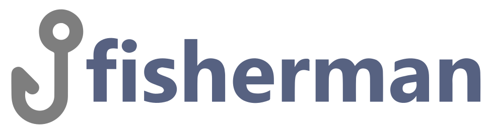

<!--suppress HtmlDeprecatedAttribute -->
<p align="center">
  <a href="https://github.com/evg4b/fisherman" title="fisherman">
    
  </a>
</p>
<p align="center">
  Small git hook management tool for developer.
</p>
<hr>
<div align="center">
    <a href="https://github.com/evg4b/fisherman/actions/workflows/build.yml">
        
    </a>
    <a href="https://github.com/evg4b/fisherman/actions/workflows/analize.yml">
        
    </a>
    <a title="SonarCloud code coverage" href="https://sonarcloud.io/component_measures?id=evg4b_fisherman&metric=coverage&view=list">
        
    </a>
    <a href="https://sonarcloud.io/component_measures?id=evg4b_fisherman&metric=coverage">
        
    </a>
    <br />
    <a title="SonarCloud lines of code" href="https://sonarcloud.io/code?id=evg4b_fisherman">
      
    </a>
    <a title="Quality Gate Status" href="https://sonarcloud.io/summary/new_code?id=evg4b_fisherman">
      
    </a>
    <a title="Security Rating" href="https://sonarcloud.io/summary/new_code?id=evg4b_fisherman">
      
    </a>
    
</div>

## Install using Cargo

You can install Fisherman via [Cargo](https://doc.rust-lang.org/cargo/#the-cargo-book):

```bash
cargo install --git https://github.com/evg4b/fisherman.git
```

## Install Precompiled Binaries

1.	Go to the [Build](https://github.com/evg4b/fisherman/actions/workflows/build.yml?query=branch%3Amaster+is%3Asuccess) workflow.
2.	Select the latest successful run.
3.	Scroll down to the Artifacts section.
4.	Download the binaries matching your system and architecture.

> **Note:** Fisherman is still in development, so you use it at your own risk.
